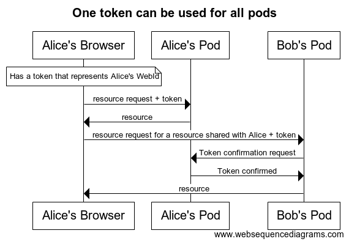
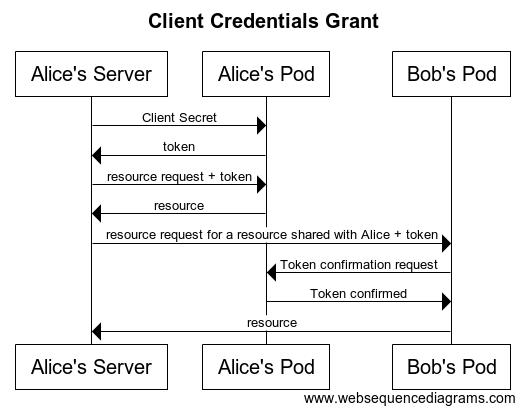
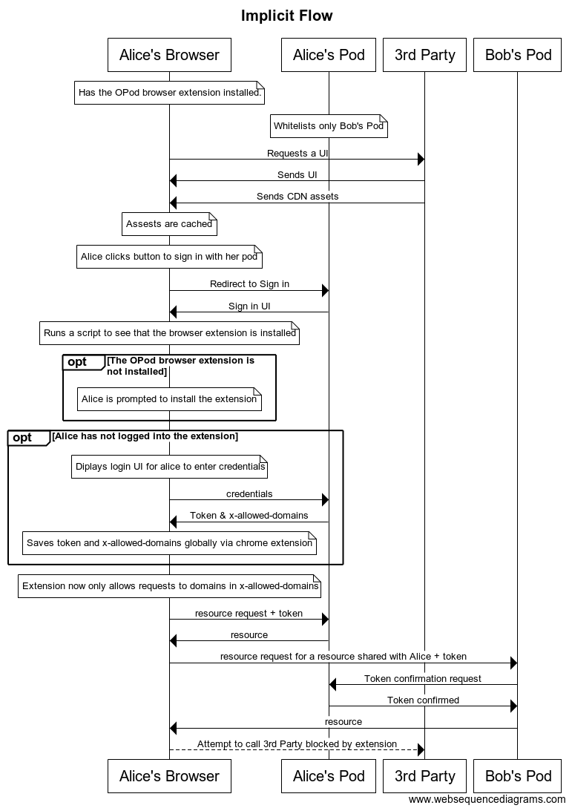

# Authorization

## Table of Contents

## Conceptual Overview

Authorizing your service or application is a process that always ends with receiving an access token (in the form of a [JSON Web Token](https://jwt.io)) that represents the pod. This token not only can be used to perform requests on its pod of origin, but a request on any pod (see figure below)



When a token is sent to its origin pod, it is checked for validity and is either accepted or rejected. But, when a token is sent to a different pod, that pod lacks the information to validate the token. It sends a confirmation request to the origin pod which responds with the token's validity.

### Obtaining a Token

The process for obtaining a token is based on [OIDC](https://openid.net/specs/openid-connect-core-1_0.html). There are two ways to obtain a token: via a Client Credentials Grant, or a Resource Owner Password Credentials Grant.

**Note** Authenticating with an Solid++ can only be done in these two ways. There are other use cases in OIDC that are satisfied via Solid++'s [standards to request access](accessControl.md).

#### Client Credentials Grant
Client Credentials Grants are used when the service you're building will always be owned by you (it will never be run on a device owned by a third party). 



Each pod has a client secret that should only be accessible by the client pod owner. Sending this client secret to the pod will guarantee the service is owned by the same entity that owns the pod.

**WARNING**: Do not share your client secret with any 3rd party.

Upon sending a client secret to the pod, you will recieve a token in return that represent the pod's WebId.

#### Implicit Flow

The Implicit Flow is used when authroizing code from a 3rd party (A web page or an app). 

Authenticating via the implicit flow is similar to OIDC's implicit flow with a few modifications made by the special Solid++ browser extension.



After loading and caching all UI elements, a request to redirect to a sign in page (usually triggered by a user clicking a login button). This request contains a redirect uri and optionally parameters to allow a webpage to make external requests or give data access to an external pod.

Before displaying the login UI, the system will check if the Solid++ browser extension is installed and prompt the user to install it accordingly.

The Solid++ extension might already have logged in, if not, it will prompt the user for login credentials.

A display is shown where a user can confirm or deny an app's access to data. App developers will be given a chance to explain why it needs a certain kind of access.

If the user consents to everything the browser redirects with a token and a header "x-allowed-domains." This is a list of domains the web app is allowed to make requests to.

For information on this flow see [Implicit Flow (In Detail)]()

#### Differences with OIDC
While authentication is based on the OIDC, there are some distict differences that should be noted.

* There are no scopes. Instead, each resource on a resource provider is able to be accessed by various whitelisted WebIds. Requesting a resource with a token that corresponds to the WebId will provide that resource.
* Only Client Credential Grants and the Implicit flow are allowed. Any tokens that represent a 3rd party's permission to access a certain resource are not allowed. Instead to access 

## Beginning Authorization (In Detail)

### Getting details

Every pod's authorization might be slightly different. Information on how to authorize your service can be accessed by making a request for the openid-configuration.

Request:
```
GET https://mypod.com/.well-known/openid-configuration
```

Response:


// TODO: trim this down
```
{
    "authorization_endpoint": "https://mypod.com/auth",
    "claims_parameter_supported": false,
    "claims_supported": [],
    "grant_types_supported": [
        "implicit",
        "client_credentials"
    ],
    "id_token_signing_alg_values_supported": [
        "HS256",
        "RS256"
    ],
    "issuer": "https://mypod.com/auth",
    "jwks_uri": "https://mypod.com/certs",
    "registration_endpoint": "https://mypod.com/reg",
    "request_parameter_supported": false,
    "request_uri_parameter_supported": false,
    "require_request_uri_registration": false,
    "response_modes_supported": [
        "fragment",
        "query"
    ],
    "response_types_supported": [
        "code id_token token",
        "code id_token",
        "code token",
        "code",
        "id_token token",
        "id_token",
        "none"
    ]
    "subject_types_supported": [
        "public"
    ],
    "token_endpoint": "https://d.o.team/token",
    "token_endpoint_auth_methods_supported": [
        "none",
        "client_secret_basic",
        "client_secret_jwt",
        "client_secret_post",
        "private_key_jwt"
    ],
    "token_endpoint_auth_signing_alg_values_supported": [
        "HS256",
        "RS256",
        "PS256",
        "ES256"
    ],
    "userinfo_endpoint": "https://d.o.team/me",
    "userinfo_signing_alg_values_supported": [
        "HS256",
        "RS256"
    ],
    "code_challenge_methods_supported": [
        "S256"
    ],
    "introspection_endpoint": "https://d.o.team/token/introspection",
    "introspection_endpoint_auth_methods_supported": [
        "none",
        "client_secret_basic",
        "client_secret_jwt",
        "client_secret_post",
        "private_key_jwt"
    ],
    "introspection_endpoint_auth_signing_alg_values_supported": [
        "HS256",
        "RS256",
        "PS256",
        "ES256"
    ],
    "revocation_endpoint": "https://d.o.team/token/revocation",
    "revocation_endpoint_auth_methods_supported": [
        "none",
        "client_secret_basic",
        "client_secret_jwt",
        "client_secret_post",
        "private_key_jwt"
    ],
    "revocation_endpoint_auth_signing_alg_values_supported": [
        "HS256",
        "RS256",
        "PS256",
        "ES256"
    ],
    "id_token_encryption_alg_values_supported": [
        "A128KW",
        "A256KW",
        "ECDH-ES",
        "ECDH-ES+A128KW",
        "ECDH-ES+A256KW",
        "RSA-OAEP"
    ],
    "id_token_encryption_enc_values_supported": [
        "A128CBC-HS256",
        "A128GCM",
        "A256CBC-HS512",
        "A256GCM"
    ],
    "userinfo_encryption_alg_values_supported": [
        "A128KW",
        "A256KW",
        "ECDH-ES",
        "ECDH-ES+A128KW",
        "ECDH-ES+A256KW",
        "RSA-OAEP"
    ],
    "userinfo_encryption_enc_values_supported": [
        "A128CBC-HS256",
        "A128GCM",
        "A256CBC-HS512",
        "A256GCM"
    ],
    "request_object_encryption_alg_values_supported": [
        "A128KW",
        "A256KW"
    ],
    "request_object_encryption_enc_values_supported": [
        "A128CBC-HS256",
        "A128GCM",
        "A256CBC-HS512",
        "A256GCM"
    ],
    "end_session_endpoint": "https://d.o.team/session/end",
    "check_session_iframe": "https://d.o.team/session/check",
    "claim_types_supported": [
        "normal"
    ]
}
```

### Fetch Certs

GET https://d.o.team/certs
Returns certs used for encryption

### Register the client


OPTIONS https://d.o.team/reg
Aids in dynamic client registration
https://openid.net/specs/openid-connect-registration-1_0.html


## Client Credentials Grant (In Detail)


## Implicit Flow (In Detail)
