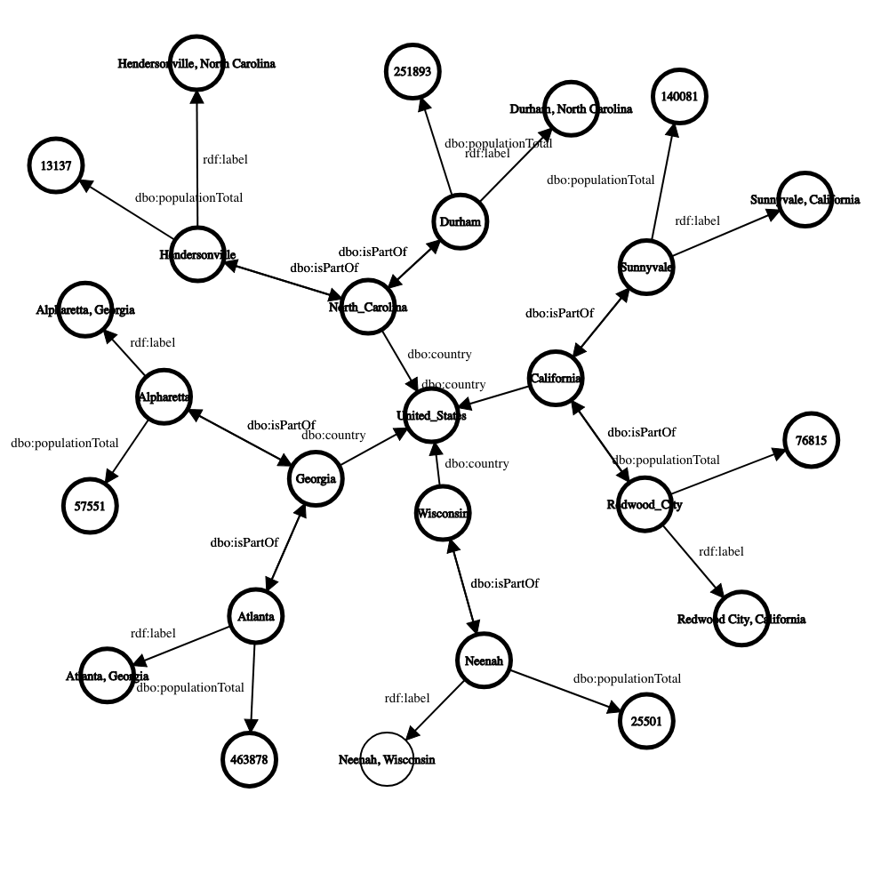

# GraphQL Support

**NOTE** The contents of this page may be depricated because I didn't know about GraphQL-LD. Might be better just to use that.

Pods can optionally support [GraphQL](https://graphql.org/), a popular query language using JSON to query services. In this document we outline the interface used to query a pod using GraphQL.

## Table of Contents


## Identifying the Endpoint

Not all pods have the same configuration. Before querying a graphql endpoint check to be sure it is enabled, and if so use the endpoint provided. Do not assume it is /graphql.

Request:
```
curl -X GET \
  https://mypod.com/.well-known/pod-configuration \
```

Response:
```
{
  ...
  "graphql_supported": true,
  "graphql_endpoint": "https://mypod.com/graphql",
  ...
}
```


## Registering a Coniguration

Because every pod might have different data, as a developer querying the pod, you must provide a configuration to describe your query to the server.

You can find many configurations for common tasks here (TODO add in a place where creators can submit configurations).

Configurations are based on a modified version of the [GraphQL Schema Language](https://graphql.org/learn/schema/). In addition to `type`, `schema`, `interface` and `enum` statemenets, an additional `context` statement is added to help translate the easily accessible single word statements to the more concrete definitions in the pod's graph.

To make a custom configuration, we can follow the upcoming example. Let's say we have the following graph in our pod (represented in rdf [here](assets/sampleGraph.ttl)):



Below is a GraphQL configuration that can help query this graph:

```
context {
  label: "http://www.w3.org/1999/02/22-rdf-syntax-ns#label"
  isPartOf: "http://dbpedia.org/ontology/isPartOf"
  populationTotal: "http://dbpedia.org/ontology/populationTotal"
  country: "http://dbpedia.org/ontology/country"
  Countries: "SELECT ?s WHERE { ?s a <http://dbpedia.org/ontology/Country> }"
  States: "SELECT ?s WHERE { ?s a <http://dbpedia.org/ontology/Region> }"
  Cities: "SELECT ?s WHERE { ?s a <http://dbpedia.org/ontology/City> }"
}

schema {
  query: RootQueryType
  mutation: RootMutationType
}

type RootQueryType {
  Countries: [Country]
  States: [State]
  Cities: [City]
}

type RootMutationType {
  createCountry(id: ID, label: String): Country
  createState(id: ID, label: String, isPartOf: [City], country: Country): State
  createCity(id: ID, label: String, isPartOf: [State], populationTotal: Int, country: Country): City
}

type Country {
  id: ID
  label: String
}

type State {
  id: ID
  label: String
  isPartOf: [City]
  country: Country
}

type City {
  id: ID
  label: String
  isPartOf: [State]
  populationTotal: Int
  country: Country
}
```

There are a few differences between this required schema and the standard GraphQL schema:
* The `context` statement is new. This statement allows you to map keys in a GraphQL query to property urls in the rdf graph. For properties that don't have parents, you are required to insert a SPARQL query.
* When providing arguments, the arguments must correspond with a key in the resulting object and one in the `context` statement.

Finally we can make our request to submit the config. The request will respond with the config's id, which will be used in the next section to query our service using GraphQL.

Request:
```
POST https://mypod.com/graphql
Authorization: Bearer MY_AUTH_TOKEN
```

Request Body:
```
context {
  label: "http://www.w3.org/1999/02/22-rdf-syntax-ns#label"
  isPartOf: "http://dbpedia.org/ontology/isPartOf"
...
  country: Country
}
```

Response Body:
```
GRAPHQL_CONFIG_ID
```

## Sending a Query

Once a configuration is submitted you can send GraphQL queries using the returned id. For example, let's say that the above example was executed. Then we could make the following request:

Request:
```
GET https://mypod.com/graphql/GRAPHQL_CONFIG_ID?query={ Cities { label, isPartOf { label } } }
Authorization: Bearer MY_AUTH_TOKEN
```

Response Body:
```
{
  data: [
    {
      label: "Alpharetta, Georgia",
      isPartOf: {
        label: "Georgia (U.S. State)"
      }
    },
    {
      label: "Hendersonville, North Carolina",
      isPartOf: {
        label: "North Carolina"
      }
    },
    ...
  ]
}
```

## Registering a Configuration using RDF

When you register a configuration, it is translated into SPARQL. You can also simply submit updates via the SPARQL interface to set GraphQL configurations.

TODO describe how to structure data in SPARQL for GraphQL
